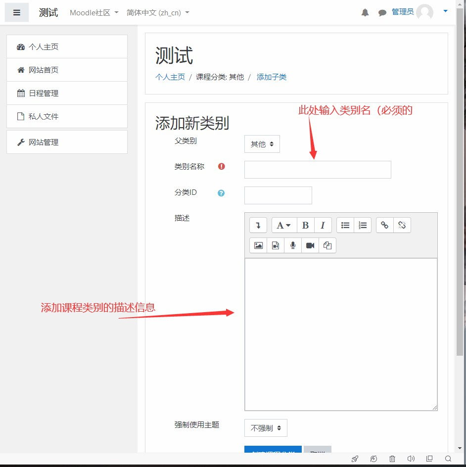
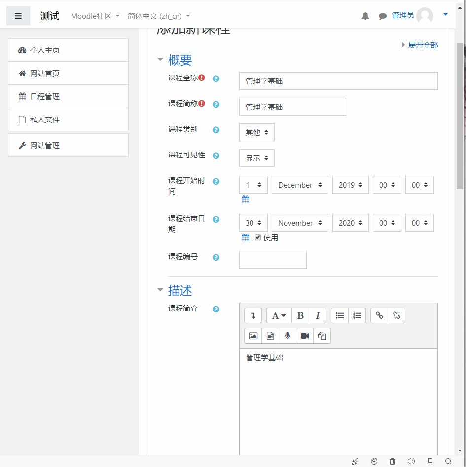
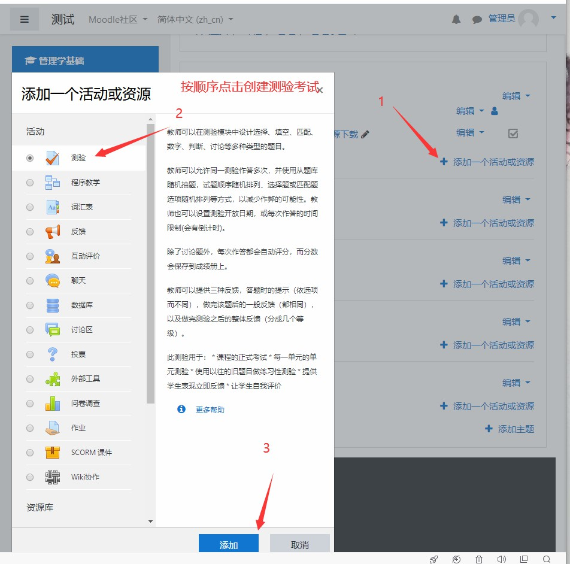
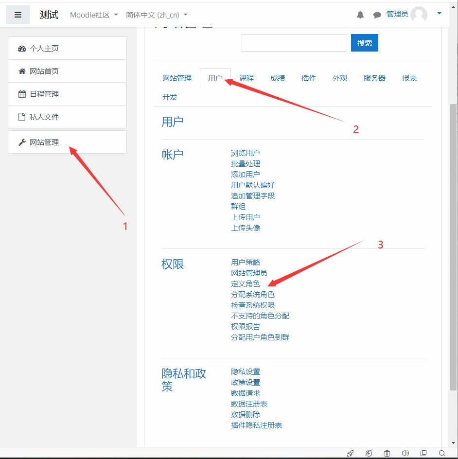
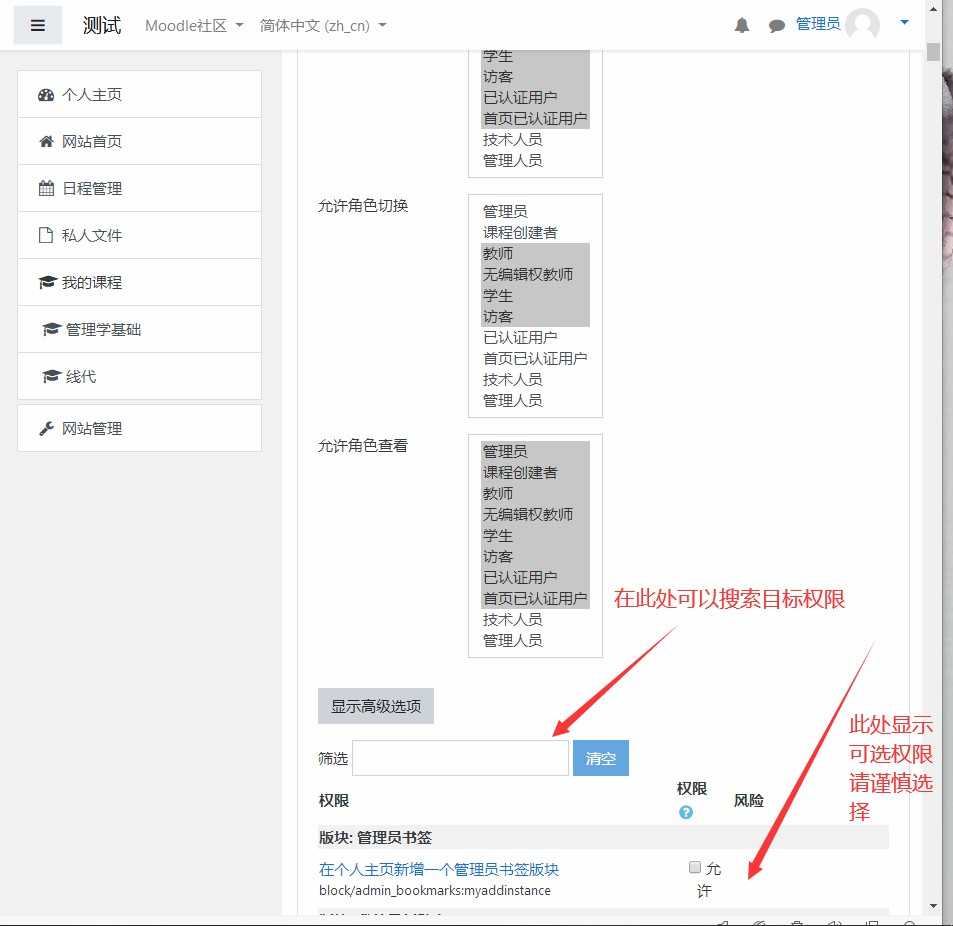

[TOC]

# 一，安装步骤

1. 进行以下步骤前需要先确保服务器环境配置成功，moodle的安装过程是要通过浏览器来控制，在浏览器访问自己部署moodle网站的网址，这里要注意：**第一次访问的网址决定了以后网站访问地址**

2. 选择完需要的语言后点击向后进入下一步

3. 

4. 

   

**以上为安装步骤截图**

# 二，课程管理

## 1，课程分类

### 1.1，创建课程分类

按一下顺序点击创建课程分类

### 1.2，修改课程分类

## 2，课程查询

按一下顺序点击

在网站首页会显示课程，如果要显示搜索框可按上图操作

## 3，课程CURD

### 3.1，创建课程

### 3.2， 删除课程

### 3.3，修改课程

### 3.4，课程资料管理

#### 3.4.1，课程资料上传

#### 3.4.2，课程视频音频上传

## 4，试题管理

### 4.1，创建试题

### 4.2， 管理试题

## 5, 考试管理

### 5.1，创建考试

### 5.2，修改考试

## 三，用户管理

### 1，用户角色设置

1. 设置业务管理角色

   

   

   

   

   将 ***附件***  中对应的文件拖入图示位置

   

   

   

2. 设置技术人员角色

   

   

   

   

   

   

   

3. 设置管理人员角色

   

   

   

   

4. 设置公众学员角色

   

   

   

   

   

### 2，角色权限设置

## 四，档案管理

### 1，个人学习档案查看

### 2，用户学习档案管理

# 三，培训模块

## 1，课程模块

### 1.1，浏览课程

### 1.2，选课

### 1.3，课程跟踪

## 2，学习模块

### 2.1，上传课程资料

#### 

### 2.2，编辑课程资料

点击编辑按钮编辑课程资料

### 3.3，下载课程资料

## 3，作业模块

### 3.1，浏览作业

### 3.2，提交作业

### 3.3，作业评分

### 3.4，成绩管理

## 4，考试模块

### 4.1，查看考试

### 4.2，参加考试

### 4.3，考试评分

### 4.4，成绩管理

